# **Práctica 1: Introducción a Unity**
### **Asignatura:** Interfaces Inteligentes
### **Autora:** Vanessa Valentina Villalba Pérez
### **Correo:** alu0101265704@ull.edu.es

## **Objetivos de la práctica y pasos realizados** 
Realizar una escena 3D básica utilizando exclusivamente el editor de escenas. La escena debe configurarse de la siguiente manera:

* **Incluir objetos 3D básicos**
Para poder añadir objetos 3D básicos a la escena, solo se debe ir a la opción **GameObject>3DObject** ubicada en la barra superior y añadir los que se deseen. Para el caso de la práctica se ha añadido un Cubo y una Cápsula.
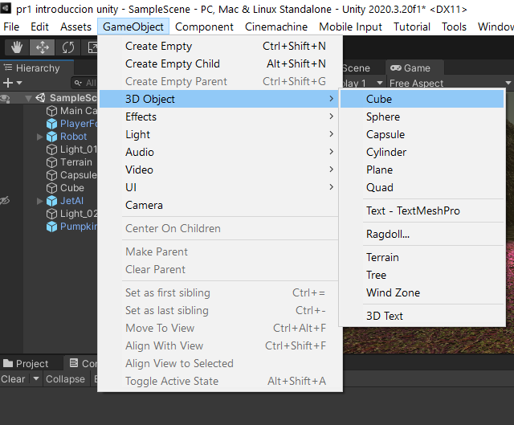

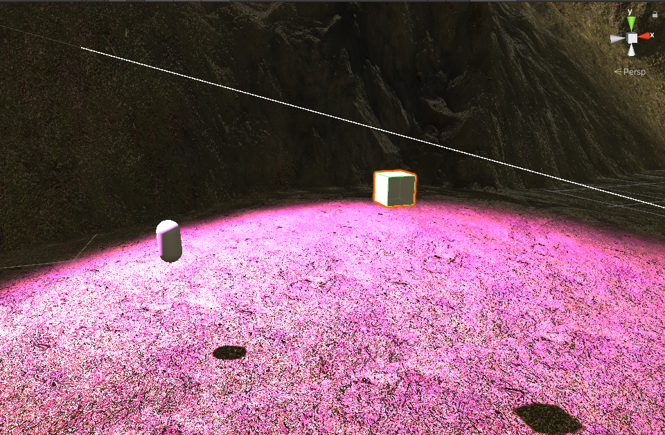

* **Incluir  algún objeto complejo de Standard Assets**
Siempre que se quiera añadir algún asset proveniente de la Assets Store existen dos alternativas:
Desde la página de Unity verificar los Assets que hayan sido añadidos a la biblioteca de Assets del usuario y seleccionar la opción *open in Unity* o directamente desde el proyecto, en la barra superior, seleccionar la opción **Window>Package Manager**.

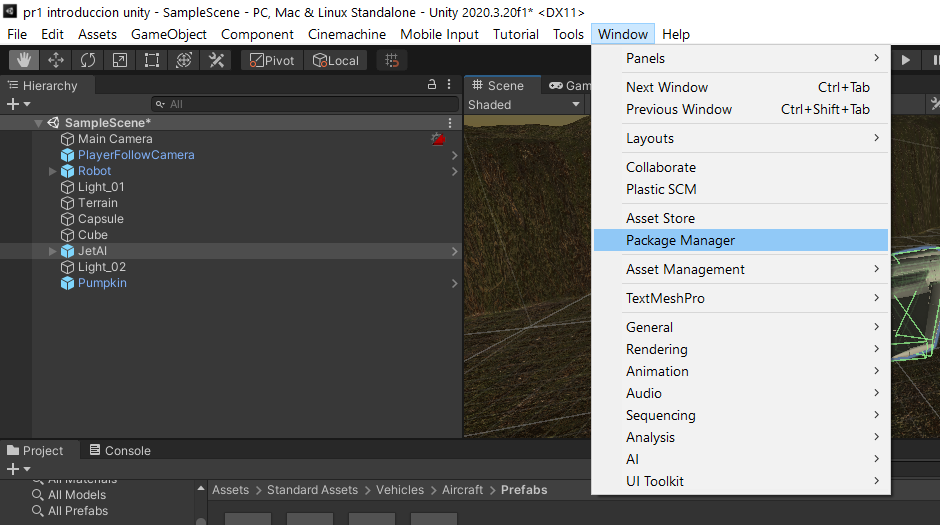

Y aparecerá la siguiente ventana con todos los Assets asociados al usuario, una vez encontrado el de *Standard Assets* se descarga y se importa directamente al proyecto.

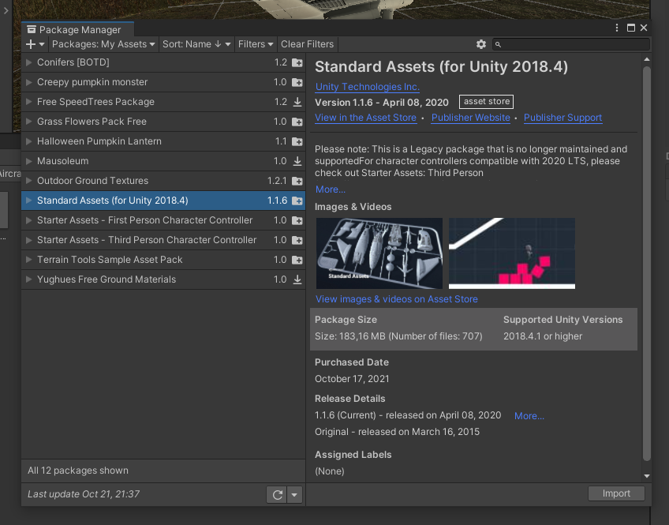

Una vez veamos que se haya añadido en el proyecto, dentro del directorio  Assets, se abrir el directorio Standard Assets y seguir la ruta **Assets/Standard Assets/Vehicles/Aircraft/prefabs** y se escoge el prefab que se prefiera, en este caso, se ha añadido el Jet dirigido por IA.

* **Incluir un objeto libre de la Asset Store que no sea de los Standard Assets** 
Como fue comentado en el apartado anterior, se debe añadir desde la Asset Store el que se desee.

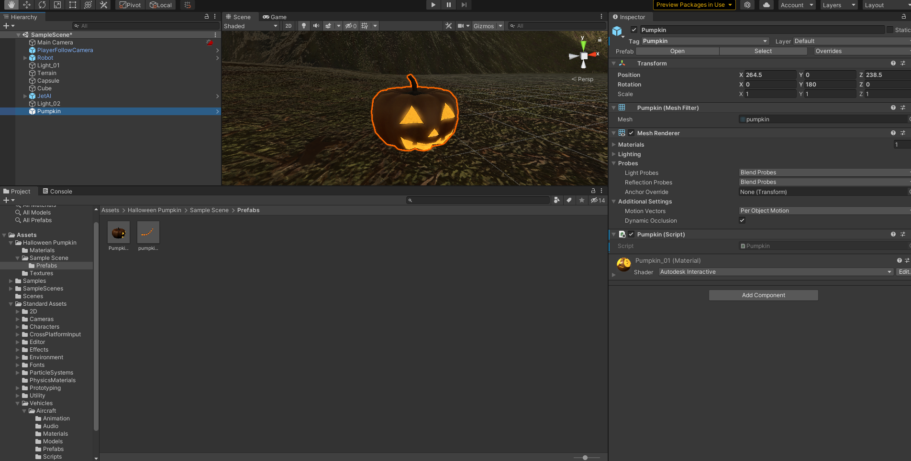

En este caso, se decidió añadir una calabaza relativa a Halloween.

* **Crear un terreno (opcional)**
Ya que el terreno también sería considerado un GameObject en la escena para añadirlo se debe ir a la misma opción de 3DObject en la barra superior y escoger la opción de Terrain.

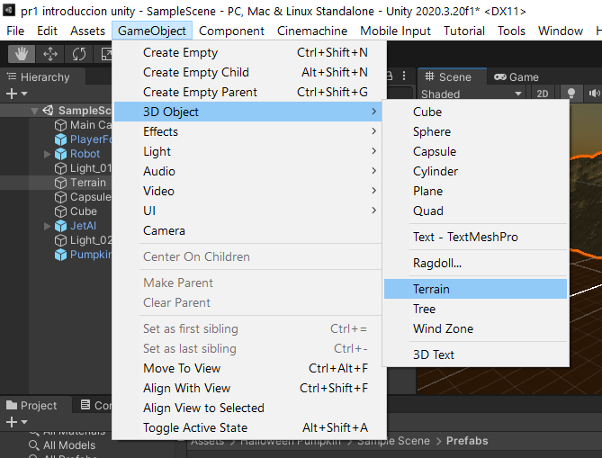

Se añade a la escena un nuevo terreno y, se puede modificar en las opciones que proporciona el Inspector, en el apartado Terrain, pulsando en el pincel se desplegarán diferentes opciones. Para la práctica se han usado las opciones *Raise or Lower Terrain* y *Pain texture* añadiéndole a este último diferentes layers para que el terreno no fuera solo de césped sino que también tuviera detalles hechos a partir de roca.

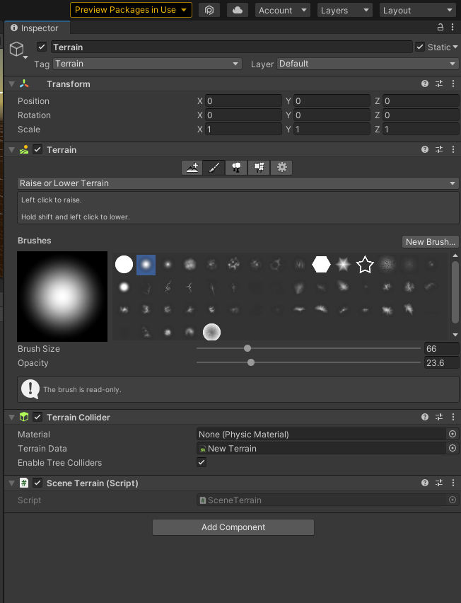

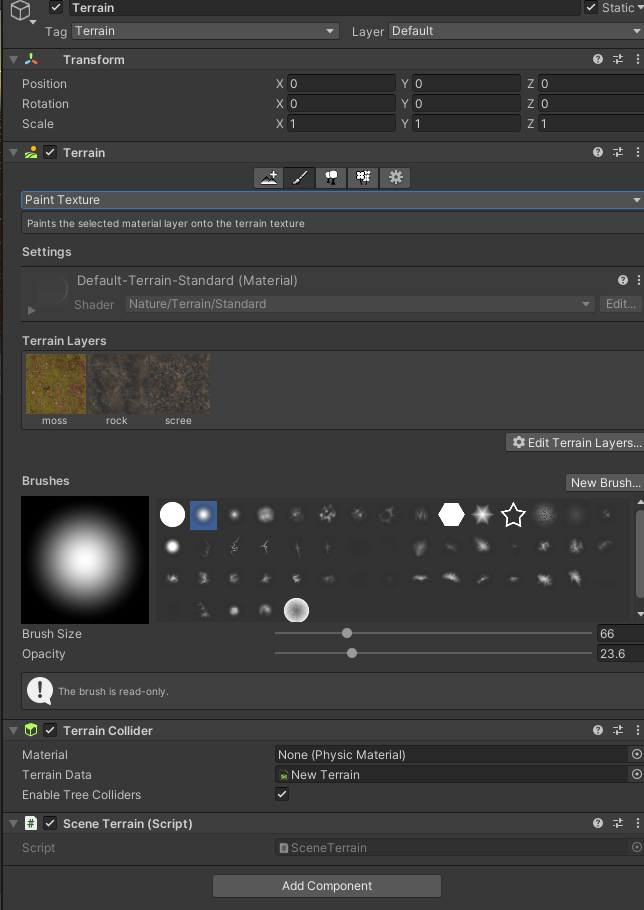

Y resulta como se puede observar en la imagen.

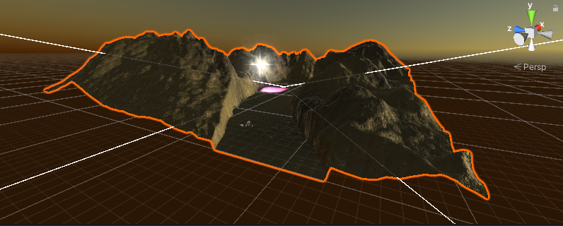

Al momento de añadir un terreno, este, por defecto tieme dimensiones 1000x1000, en este caso se ha decidido reducir a la mitad para facilitar un poco la visión de el resto de objetos en la escena.

* **Cada objeto debe tener una etiqueta que lo identifique**

Para poder añadir un tag es tan sencillo como verificar justo debajo del nombre del objecto en el Inspector si se encuentra en *Untagged* o no, de esa forma tendrá un tag asociado. 

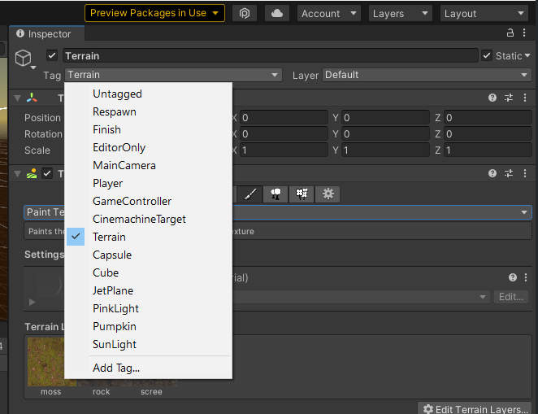

Se pueden escoger los tags que provee Unity por defecto o, en la opción que se ve en la imagen anterior de *Add Tag...* pulsarla y que se despliegue una tabla con todos los tags creados, permitiendo añadir o eliminar los que se deseen. 

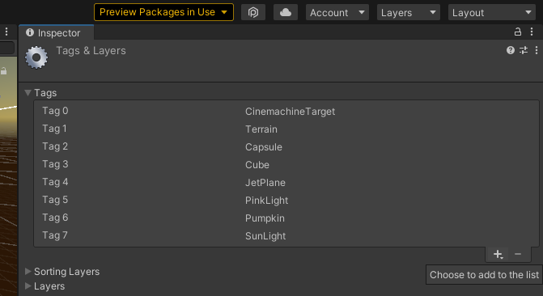

En el caso de la práctica, se han añadido uno por cada objeto de la escena para identificarlos por separado.

* **La escena debe tener 2 fuentes de luz**
Al generar un proyecto nuevo, se tiene añadido por defecto una luz del tipo directional, que en este caso fue dejada, pero modificada haciendo uso de Gizmos, rotándola, de esa forma parece que la escena se encuentra durante el anochecer. Nuevamente, se va a la opción Game Object de la barra superior y se añade un objeto de tipo ligth, para la segunda luz de la escena se ha dedicido añadir una *Spotlight* de color rosa para que pudiera notarse, justo encima de los objetos 3D.

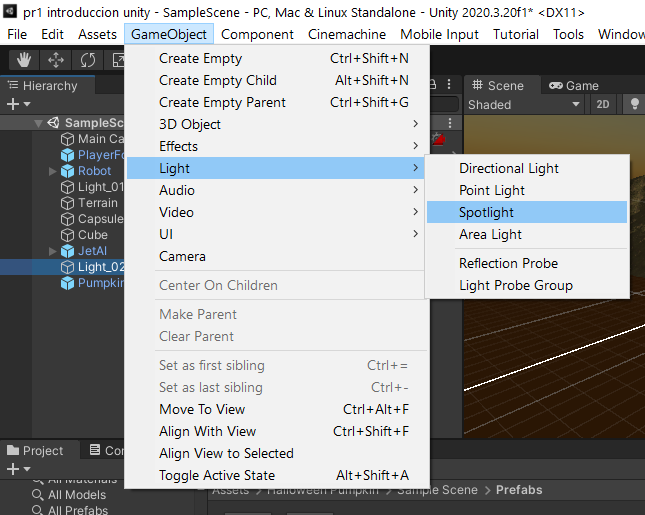

* **Utilizar prefabs de standard assets para un FPS o Third Person**
Una vez añadido desde el Package Manager el Asset correspondiente a Third Person de la Standard Assets, se va a reiniciar la ventana del proyecto, añadiendo nuevas opciones en la barra superior. 

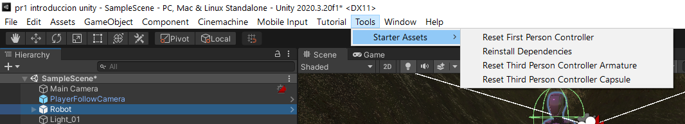

Se pulsará **Tools>Starter Assets>Reset Third Person Controller Armature** que se encargará de añadir directamente en la escena una armadura que tiene apariencia de robot, ya prefabricada que incluso puede ser movida a partir del teclado en el modo *Game* por parte del jugador. 

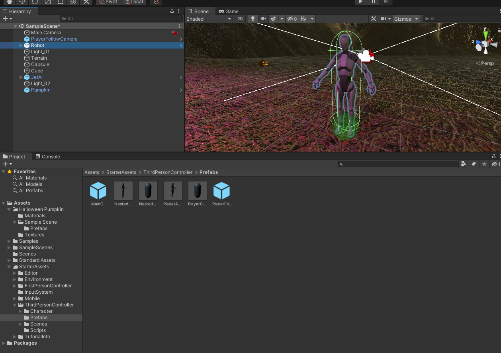

Adicionalmente, viene con una cámara integrada capaz de perseguir a la armadura para poder ser visualizada en tercera persona al ejecutar la escena.

* **Agregar un script que escriba en la consola los objetos que se han utilizado, un identificador numérico que le asignes a cada uno de los objetos  y el valor de un contador que se actualiza en cada iteración para cada objeto**

Para cada uno de los objetos añadidos en la escena, se ha añadido un script con un identificador diferente. Donde el script fue asignado en la ventana Inspector, debajo del todo pulsando **Add Component>New Script** que crea un fichero como el que se ve en la imagen y se añadió el código suficiente para imprimir por consola la información requerida

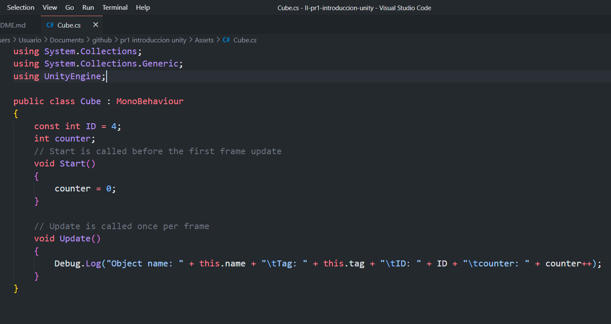

Y si se pulsa al botón de play para entrar en el Game mode de la escena y se va a la ventana de *Console* se ve lo siguiente

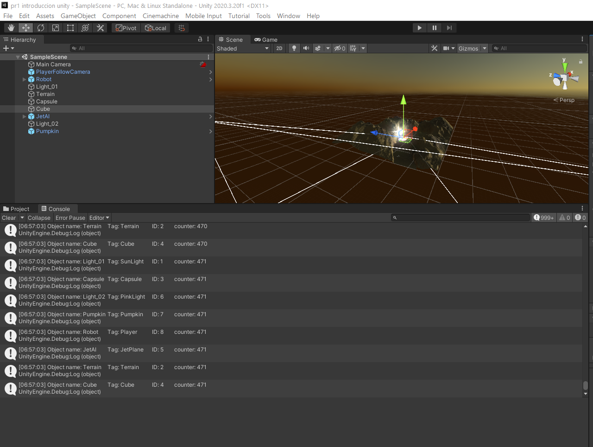

* **GIF animado de la ejecución**

